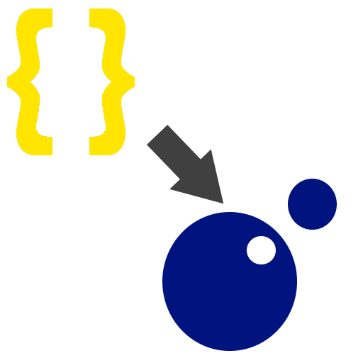
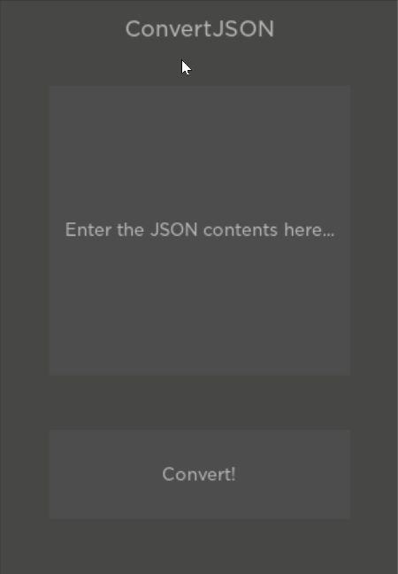

<h1 align="center">
    
</h1>

<h1 align="center">
    
</h1>

# ConvertJSON

ConvertJSON is a minimalistic Roblox Studio plugin that converts JSON input into a Lua table.

All you have to do is to enter in valid JSON into the input box, press the Convert button, and the JSON will be converted into a Lua table located in ReplicatedStorage.

## Installation
There are a few ways to install the plugin:
1. Install the plugin via Roblox
2. Install the plugin from the GitHub releases page
3. Build the plugin via Rojo

## Building the plugin
1. Clone the plugin via Git:
   ```bash
    git clone https://github.com/Jaguar-515/ConvertJSON.git
   ```
2. Build the plugin via Rojo inside the cloned repository:
   ```bash
    rojo build --output plugin.rbxmx
   ```
   
## License
This project is under the MIT license. See LICENSE.txt for more info.